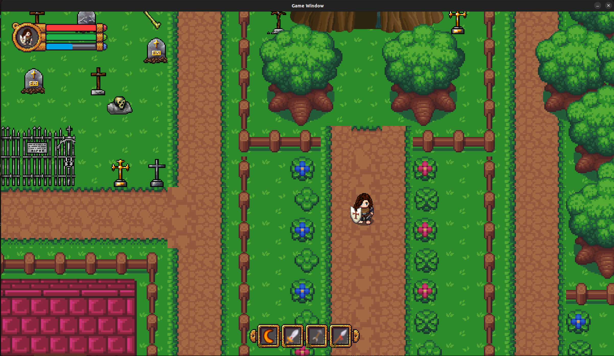
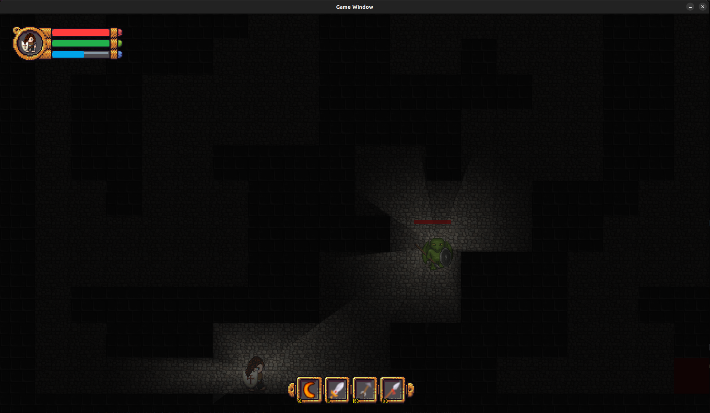

# **ShadowMaze**

*A mesmerizing journey through procedurally generated dungeons, where shadows come alive and every corner holds a new challenge. Crafted entirely from scratch without any game engine.*

---

<div align="center">
    
    
</div>

---

## **Table of Contents**

1. [Introduction](#introduction)
2. [Features](#features)
3. [Gameplay Mechanics](#gameplay-mechanics)
   - [World Exploration](#world-exploration)
   - [Dungeons](#dungeons)
   - [Combat System](#combat-system)
   - [Abilities & Cooldowns](#abilities--cooldowns)
   - [Enemies & AI](#enemies--ai)
   - [Lighting & Shadows](#lighting--shadows)
4. [Controls](#controls)
5. [Installation Guide](#installation-guide)
6. [Running the Game](#running-the-game)
7. [Dependencies](#dependencies)
8. [Code Structure](#code-structure)
   - [Core Classes](#core-classes)
   - [Subsystems](#subsystems)
9. [Contributing](#contributing)
10. [License](#license)
11. [Acknowledgments](#acknowledgments)

---

## **Introduction**

Welcome to **ShadowMaze**, a 2D action-adventure game meticulously crafted in C++ using SDL2, built entirely from the ground up without the use of any game engines. Dive into a world where every journey is unique, thanks to procedurally generated landscapes and dungeons. Face off against cunning enemies powered by sophisticated AI, master a suite of combat abilities, and navigate through a realm where shadows and light play crucial roles in your survival.

This game isn't just another indie project; it's an immersive experience that blends intricate gameplay mechanics with advanced programming techniques like multi-threading, dynamic lighting, and procedural generation. Prepare yourself for an epic adventure that challenges both your gaming skills and your strategic thinking.

---

## **Features**

- **Engine-Free Development**: Experience a game developed entirely without any game engine, showcasing pure programming and creativity.

- **Procedurally Generated Worlds**: No two playthroughs are the same. Each dungeon and overworld is uniquely crafted on the fly, providing endless exploration opportunities.

- **Dynamic Lighting & Shadows**: Immerse yourself in a world where real-time lighting affects gameplay. Shadows can conceal dangers or provide stealth opportunities.

- **Challenging Enemies**: Battle against enemies that become more formidable as you delve deeper. Their speed, damage, and health scale with each level, keeping you on your toes.

- **Rich Combat System**: Wield a variety of weapons and abilities, including slashing, thrusting, shooting arrows, and casting spells. Each ability comes with its own mechanics and cooldowns.

- **Stamina & Cooldown Management**: Balance your stamina and ability cooldowns to maintain an edge over your adversaries.

- **Multi-threaded Performance**: Enjoy smooth gameplay as the game leverages multi-threading for dungeon generation, lighting calculations, AI behaviors, and more.

- **Intuitive HUD**: Keep track of your health, stamina, and ability cooldowns with a sleek, unobtrusive HUD.

- **Scaling Health Rewards**: Defeat enemies to recover health, with the amount restored scaling dynamically based on your level.

---

## **Gameplay Mechanics**

### **World Exploration**

Begin your journey in a vast overworld teeming with life and secrets. The world is dotted with various structures, including houses, trees, fences, and, most importantly, dungeon entrances. The overworld serves as the hub for your adventures, providing resources and challenges that prepare you for the depths below.

- **Procedural Generation**: The overworld map is generated using a combination of predefined tiles and random placements, ensuring a fresh experience with each new game.

- **Structures & Landmarks**: Encounter different structures like blue and red houses, green houses, graves, crosses, and coffins. Each adds to the world’s lore and may offer interactive elements or clues.

- **Dynamic Environment**: The interplay of light and shadow in the overworld sets the mood for your adventure.

### **Dungeons**

The heart of **ShadowMaze** lies within its dungeons. These labyrinthine structures are procedurally generated using advanced maze algorithms, presenting new challenges at every level.

- **Maze Generation**: Dungeons are created using a refined version of the recursive backtracking algorithm, ensuring solvable and intriguing layouts.

- **Increasing Difficulty**: As you delve deeper, dungeons become more complex, and enemies become faster, stronger, and tougher to defeat.

- **Lighting Challenges**: Dungeons are cloaked in darkness, requiring you to rely on limited light sources, enhancing the suspense and difficulty.

- **Objectives**: Navigate through the maze, defeat enemies, and find the exit to progress to the next level or return to the overworld.

### **Combat System**

Engage in fast-paced combat using a variety of weapons and abilities. Mastering the combat system is crucial for survival.

- **Melee Attacks**:
  - **Slashing**: A wide attack dealing significant damage to nearby enemies. Ideal for crowd control.
  - **Thrusting**: A focused, piercing attack with extended range. Perfect for single-target damage.

- **Ranged Attacks**:
  - **Shooting Arrows**: Launch arrows from a distance, allowing you to damage enemies before they get close.
  - **Spellcasting**: Cast powerful spells that home in on enemies or bounce off walls, dealing massive damage.

- **Combos & Strategies**: Combine different attacks for maximum effectiveness. For example, weaken enemies with arrows before finishing them off with a thrust.

- **Stamina Management**: Each attack consumes stamina. Balancing aggression with conservation is key.

### **Abilities & Cooldowns**

Your abilities are potent but require careful timing due to cooldown periods.

- **Ability Cooldowns**:
  - **Spellcasting**: 15 seconds
  - **Slashing**: 10 seconds
  - **Shooting**: 5 seconds
  - **Thrusting**: No cooldown but consumes stamina

- **HUD Indicators**: Cooldowns are visually represented on the HUD, allowing you to plan your actions.

- **Stamina Consumption**:
  - **Running**: Consumes stamina over time.
  - **Attacks**: Each attack type consumes a specific amount of stamina.

### **Enemies & AI**

Face off against relentless enemies that become more challenging as you progress.

- **Progressive Difficulty**: Enemies increase in speed, damage, and health the deeper you venture into the dungeon, keeping the gameplay fresh and challenging.

- **Intelligent Pathfinding**: Enemies use pathfinding algorithms to navigate the dungeon and pursue you.

- **Adaptive Behaviors**:
  - **Aggression**: Enemies become more aggressive as you progress, using abilities strategically.
  - **Spellcasting Enemies**: Enemies can cast spells with curved trajectories or bouncing patterns, similar to the player.

- **Enemy Design**: While currently there's one enemy sprite, the increasing difficulty ensures that each encounter feels unique and intense.

- **Health & Damage**:
  - Enemies have their own health bars displayed above them.
  - They can take damage from all your attack types and can be defeated permanently.

- **Scaling Health Rewards**: Killing enemies restores health, with the amount restored increasing as you reach higher levels.

### **Lighting & Shadows**

Light isn't just a visual effect—it's a gameplay element.

- **Dynamic Lighting**: The game features real-time lighting effects that affect visibility and gameplay.

- **Shadow Mechanics**:
  - **Visibility**: Areas outside light sources are shrouded in darkness, hiding enemies and obstacles.
  - **Stealth & Ambush**: Both you and enemies can use shadows to your advantage.

- **Light Sources**:
  - **Player's Light**: Your character emits light that can be affected by stamina and other factors.
  - **Environmental Lights**: Torches or other light sources may be present in dungeons.

- **Advanced Lighting Techniques**: The game uses multi-layered lighting textures for a realistic and immersive experience.

---

## **Controls**

- **Movement**: `W` / `A` / `S` / `D` or Arrow Keys
- **Attack**:
  - **Thrust**: Right Mouse Button (Consumes stamina)
  - **Shoot Arrow**: Left Mouse Button (Consumes stamina and has cooldown)
  - **Spellcasting**: `Q` Key (Consumes stamina and has cooldown)
  - **Slashing**: `E` Key (Consumes stamina and has cooldown)
- **Running**: Hold `Shift` Key (Consumes stamina)
- **Menu**: `Esc` Key
- **Interact**: (If implemented) `F` Key or `Enter`

---

## **Installation Guide**

### **1. Clone the Repository**

Begin by cloning the game repository to your local machine:

```bash
git clone https://github.com/George0Simion/Game2D.git
```

### **2. Run the Installer**

Navigate to the game directory and run the installer:

```bash
cd Game2D
./installer
```

### **3. Launch the Game**

After the installation is complete, start the game:

```bash
./run
```
